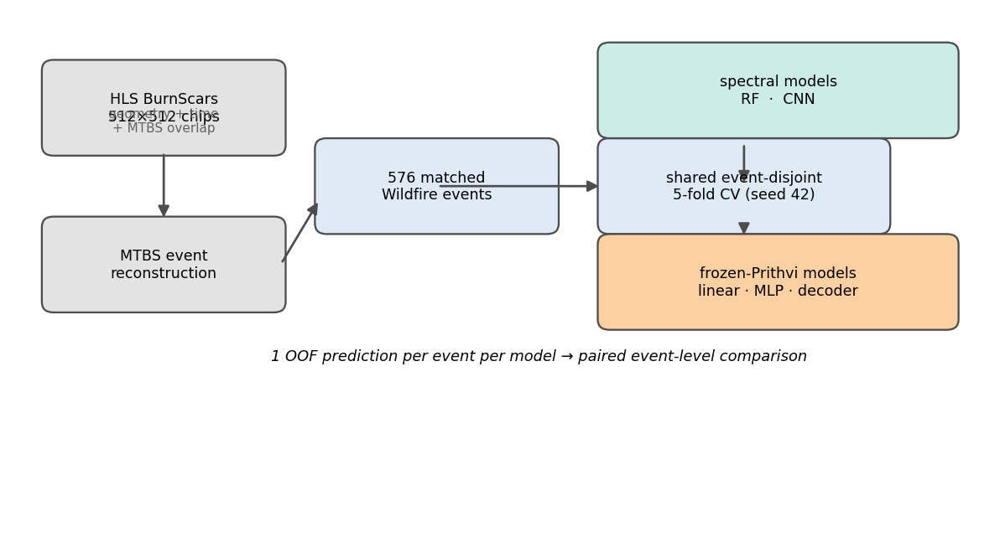
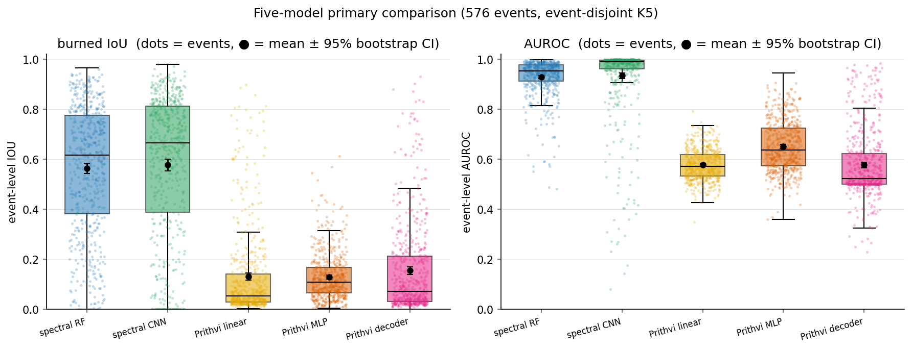
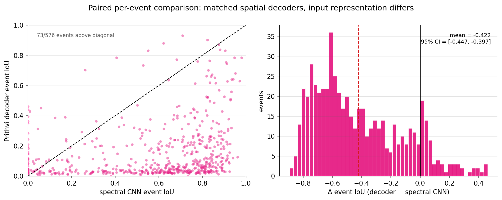
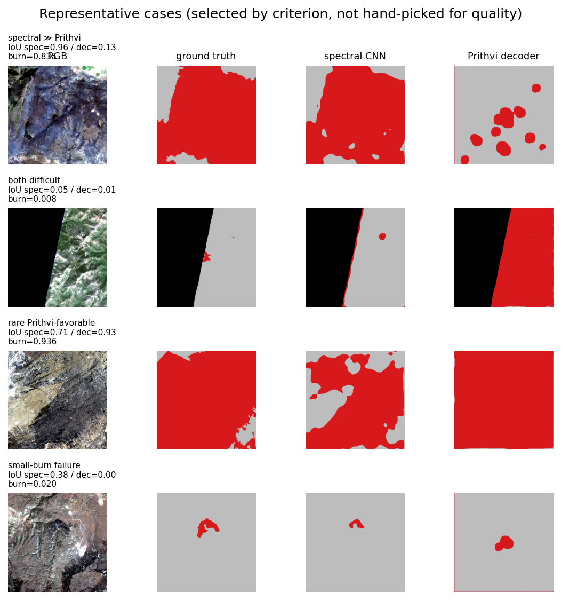

# Cross-Event Wildfire Burn-Scar Segmentation

### Do frozen foundation-model representations transfer better than conventional spectral features on unseen wildfire events?

**No — not under the readouts we tested.** Under a shared, deterministic event-disjoint
5-fold cross-validation over 576 MTBS-linked wildfire events (CONUS 2018–2021), conventional
spectral features generalize strongly (event-level IoU 0.56–0.58, AUROC ≈ 0.93), while frozen
Prithvi-EO-2.0-300M representations reach only IoU 0.13–0.16 across a linear probe, a nonlinear
pointwise MLP, and a lightweight spatial decoder.

| Model | Input representation | Trainable params | IoU | Dice | AUROC |
|---|---|---|---|---|---|
| Spectral Random Forest | 8 spectral features | — | 0.564 | 0.682 | 0.930 |
| Spectral CNN (matched control) | 8 spectral channels | 523,809 | 0.577 | 0.679 | 0.935 |
| Prithvi linear probe | frozen 4096-d features | 4,097 | 0.131 | 0.197 | 0.578 |
| Prithvi pointwise MLP | frozen 4096-d features | 1,065,345 | 0.129 | 0.218 | 0.652 |
| Prithvi spatial decoder | frozen 4×1024-d features | 655,553 | 0.155 | 0.233 | 0.578 |

*Event-level out-of-fold means over 576 events. All models share the same folds and supervision
protocol; only the input representation and readout head differ.*

The decisive comparison feeds the **same spatial-decoder architecture** either frozen Prithvi
features or the 8 spectral channels. Because only the input representation changes, the gap
isolates representation *content* from readout *capacity*:

> **Prithvi decoder − spectral CNN = −0.422 IoU [−0.447, −0.397]** (paired bootstrap 95% CI).









---

## What this study shows — and what it does not

The result is **negative but informative**, and the wording is deliberately conservative.
It establishes that *frozen* Prithvi-EO-2.0 representations transferred poorly to cross-event
single-date burn-scar segmentation **under the specific readouts tested**, while conventional
spectral representations remained substantially more transferable under the identical
event-disjoint evaluation.

It does **not** claim that Prithvi is a poor foundation model in general, that foundation models
cannot work for wildfire mapping, that the frozen features contain *no* burn information, that
decoder capacity has been ruled out, or that the gap is *proven* to arise from representation
content alone. Fine-tuning and task-specific adaptation were not tested and remain the obvious
next step. See the full statement of claims and limitations in
[docs/RESEARCH_SUMMARY.md](docs/RESEARCH_SUMMARY.md).

## Why it matters

Cross-event generalization is what wildfire mapping actually requires in deployment: new fires,
new geographies, and no overlap with the training scenes. Random train/test splits can overstate
performance because training and test pixels share spatial and environmental context. This study
evaluates transfer to *entirely unseen events* under a clean protocol, and shows that a widely
used Earth-observation foundation model's frozen representations do **not** transfer automatically
to burn-scar segmentation — while a cheap spectral baseline remains strong. The bottleneck is not
the readout but the frozen representation's weak transferable burn signal, pointing toward encoder
adaptation as the next lever.

## Approach

**Dataset.** `ibm-nasa-geospatial/hls_burn_scars` — 512×512 HLS chips (6 bands: B02, B03, B04,
B8A, B11, B12), CONUS 2018–2021, MTBS-derived burn-scar labels. The dataset ships no explicit
event identity, so events were reconstructed by matching chip geometry (CRS, affine transform,
bounds, acquisition date) to MTBS fire perimeters, yielding **576 reliably matched wildfire
events** (one post-fire chip each). Prescribed-fire, unknown, ambiguous, and unmatched events are
excluded from the primary benchmark.

**Protocol.** A shared, deterministic event-disjoint 5-fold cross-validation (seed 42), stratified
by fire year × burned-fraction quantile. Pixel-level splitting is forbidden throughout; pixels are
never treated as independent statistical units. All models train under an identical supervision
budget (≤ 2048 sampled valid pixels per chip, BCE + AdamW, inner-validation burned-Dice threshold),
and the held-out test set is touched once per fold. Statistics are event-level (IoU, Dice,
precision, recall, AUPRC, AUROC) with percentile-bootstrap 95% CIs (10,000 resamples, seed 42) and
paired per-event deltas.

**Models.** A spectral Random Forest baseline; a matched-capacity spectral CNN control; and three
frozen-Prithvi readouts (linear probe, pointwise MLP, lightweight spatial decoder). The Prithvi
encoder is the foundation checkpoint only — 303,886,336 parameters, fully frozen, layers
`[5, 11, 17, 23]` concatenated.

## Repository layout

```text
data/metadata/   tracked events, attributes, and split manifests (small CSVs)
docs/            abstract, one-page summary, full research summary, reproducibility, notes
src/             data, features, evaluation, model-head, and Prithvi-encoder code
scripts/         data prep, baselines, frozen-feature, readout, and figure scripts
results/         final comparison CSVs and figures (large predictions/embeddings gitignored)
tests/           splitting / leakage / head-architecture tests
```

## Reproducing the results

```bash
# 1. Create the environment (Python 3.11):
conda env create -f environment.yml
conda activate prithvi-wf

# 2. Run the test suite (works from committed metadata + results alone):
python -m pytest tests/ -q

# 3. Regenerate the comparison tables from the committed per-event out-of-fold results:
python scripts/m5_compare.py
```

The final figures (`results/figures/final/*.png`) and comparison tables
(`results/m5_compare/*.csv`) are committed. The per-event out-of-fold predictions behind them are
also committed, so most of `m5_compare.py` runs from a clean checkout — the boundary-error table
additionally needs raw HLS imagery and regenerated `.npy` prediction maps. Raw HLS/MTBS data,
model weights, and the frozen feature cache are large and **not** committed; the full pipeline
(data preparation, event reconstruction, feature extraction, and every experiment) is documented
step-by-step in [docs/REPRODUCIBILITY.md](docs/REPRODUCIBILITY.md).

## Documents

- [Abstract](docs/ABSTRACT.md)
- [One-page summary](docs/ONE_PAGE_RESEARCH_SUMMARY.md)
- [Full research summary](docs/RESEARCH_SUMMARY.md)
- [Reproducibility guide](docs/REPRODUCIBILITY.md)
- [Prithvi-EO-2.0 technical notes](docs/prithvi_notes.md)

## Limitations (summary)

Event ≈ one scene (a single 512×512 chip); single-date imagery (no pre/post contrast, no dNBR);
"unseen event" means unseen in downstream training, with foundation-model pretraining exposure
uncontrolled; frozen-only evaluation (fine-tuning not tested); one foundation checkpoint; and a
deliberately limited decoder search. Small burned fractions are the dominant failure regime for
all models. The complete list is in [docs/RESEARCH_SUMMARY.md](docs/RESEARCH_SUMMARY.md).
